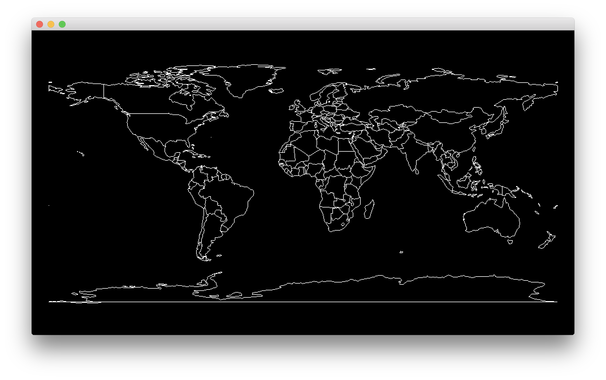
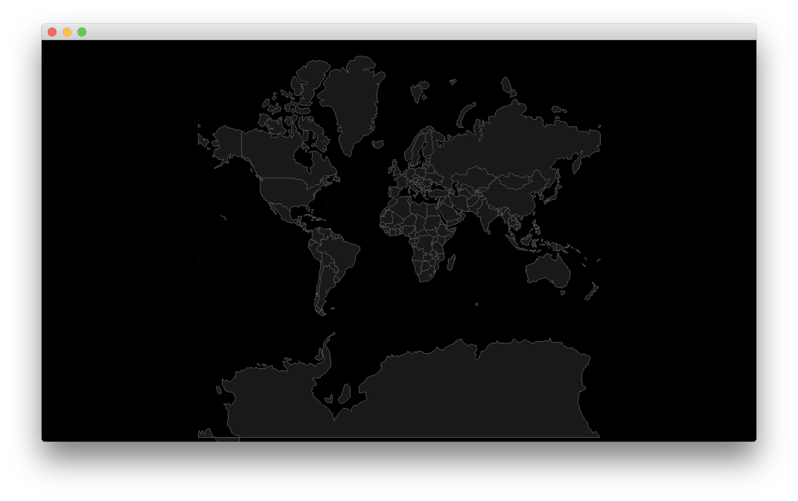

# cinder-geojson-experiments
Experiments drawing maps and plotting geocoded data using Cinder, OpenGL and the GeoJSON data format.

## Country Shapes

The above is a screen shot from the most basic demo. It simply loads `countries.geo.json`, creates a `ci::Shape2D` object for each country and draws it to the screen.

## Map Projections

The above is a screenshot of the countries map drawn with a standard Mercator projection.

#### References:
 * https://tools.ietf.org/html/rfc7946
 * https://macwright.org/2015/03/23/geojson-second-bite
 * https://wiki.openstreetmap.org/wiki/Mercator

#### Data Sources:
 * https://github.com/johan/world.geo.json/blob/master/countries.geo.json
